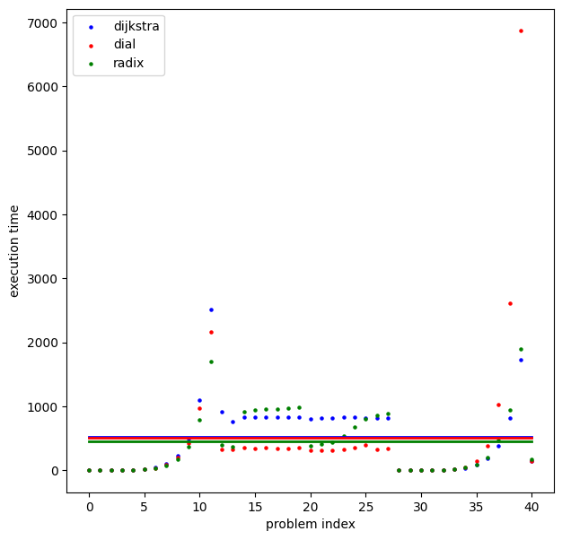

<script type="text/javascript"
  src="https://cdnjs.cloudflare.com/ajax/libs/mathjax/2.7.0/MathJax.js?config=TeX-AMS_CHTML">
</script>
<script type="text/x-mathjax-config">
  MathJax.Hub.Config({
    tex2jax: {
      inlineMath: [['$','$'], ['\\(','\\)']],
      processEscapes: true},
      jax: ["input/TeX","input/MathML","input/AsciiMath","output/CommonHTML"],
      extensions: ["tex2jax.js","mml2jax.js","asciimath2jax.js","MathMenu.js","MathZoom.js","AssistiveMML.js", "[Contrib]/a11y/accessibility-menu.js"],
      TeX: {
      extensions: ["AMSmath.js","AMSsymbols.js","noErrors.js","noUndefined.js"],
      equationNumbers: {
      autoNumber: "AMS"
      }
    }
  });
</script>

<div align="center">

# Algorytmy Optymalizacji Dyskretnej - lab 3

Jakub Musiał 268442

<div align="left">

<br />

## 1. Wprowadzenie

* Zadanie - zaimplementować 3 warianty algorytmu dijkstry na znajdywanie długości najkrótszych scieżek ze źródła do pozostałych wierzchołków grafu:
  * Wariant podstawowy z użyciem kopca binarnego
  * Algorytm Diala
  * Wariant radix heap

* Implementacja - C++

<br />
<br />

## 2. Opis algorytmów

Implementacja każdego z wyżej wymienionych algorytmów jest taka sama, jednak dla każdego algorytmu użyta jest inna struktura:

* Wariant podstawowy - C++ STL std::priority_queue (kopiec binarny)
* Algorytm Diala - custom bucket_queue (implementacja w pliku `project/dial.cpp`)
* Wariant radix heap - custom radix heap (implementacja w pliku `project/radix.cpp`)

<br />

Algorytm znajdywania najkrótszych ścieżek:

```
shortest_paths (graph, source):
    # Initialize necessary structures
    visited = vector(size = graph.num_vertices, default_value = false)
    distances = vector(size = graph.num_vertices, default_value = infinity)

    S = structure()
    S.push(vertex = source, distance = 0)
    distances[source] = 0

    while not S.empty():
        # Extract the first element from S
        node = S.first()
        S.pop_first()

        if visited[node.vertex] == false:
            # Visit the vertex and update distances of it's neighbours
            visited[node.vertex] = true
            old_distance = distances[node.vertex]

            for edge in graph.adjacent(node.vertex):
                new_distance = old_distance + edge.wight
                if new_distance < distances[edge.destination]:
                    distances[edge.destination] = new_distance
                    S.push(vertex = edge.destination, distance = new_distance)

    return distances
```

<br />
<br />

## 3. Złożoność obliczeniowa algorytmów:

> Niech $n = |V| \land m = |E|$
>
> $T(\text{BFS}) = O((n \times T_{delete}) + (m \times T_{insert}))$
>
> \* $\text{W grafie spójnym: } m \geq n - 1$

* Wariant podstawowy: $O(m \times \log{n})$

    > $T_{insert} = T_{delete} = O(H) = O(\log{n})$
    > 
    > $T(\text{BFS}) = O((n \times \log{n}) + (m \times \log{n})) = O((n + m) \times \log{n}) =^* O(m \times \log{n})$

* Algorytm Diala: $O(m + nC)$ gdzie $C \equiv \text{maxymalna waga krawędzi w grafie}$

    > $T_{insert} = O(1)$
    > 
    > $T_{delete} = O(C)$
    > 
    > $T(\text{BFS}) = O((n \times C) + (m \times O(1))) = O(nC + m)$

* Wariant radix heap: $O(n \times \log{nC} + m)$: 

    > $T_{insert} = O(1)$
    > 
    > $T_{delete} = O(\log{n \times C}) \rightarrow \text{koszt przeniesienia elementów do wcześniejszych kubełków}$
    > 
    > $T(\text{BFS}) = O((n \times \log{n \times C}) + (m \times O(1))) = O(n \times \log{nC} + m)$

<br />
<br />

## 4. Wyniki eksperymentów

Poniższy wykres przedstawia średnie czasy działania poszczególnych algorytmów dla zadanego problemu (graf oraz lista źródeł)

<div align="center">



<div align="left">

Można zauważyć, że podstawowy wariant algorytmu dijkstry działa najwolniej, natomiast najszybszy jest wariant radix heap