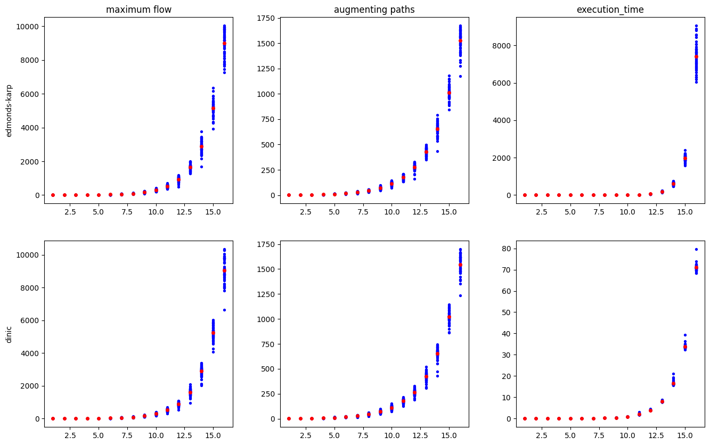
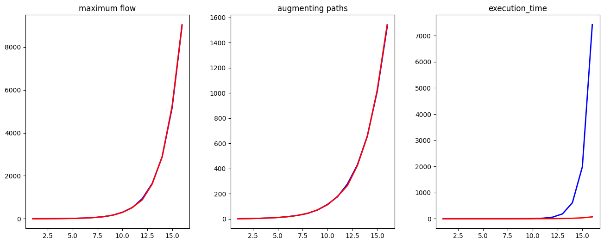
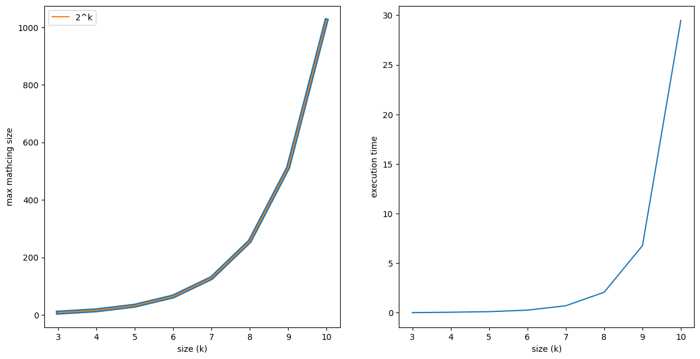

<script type="text/javascript"
  src="https://cdnjs.cloudflare.com/ajax/libs/mathjax/2.7.0/MathJax.js?config=TeX-AMS_CHTML">
</script>
<script type="text/x-mathjax-config">
  MathJax.Hub.Config({
    tex2jax: {
      inlineMath: [['$','$'], ['\\(','\\)']],
      processEscapes: true},
      jax: ["input/TeX","input/MathML","input/AsciiMath","output/CommonHTML"],
      extensions: ["tex2jax.js","mml2jax.js","asciimath2jax.js","MathMenu.js","MathZoom.js","AssistiveMML.js", "[Contrib]/a11y/accessibility-menu.js"],
      TeX: {
      extensions: ["AMSmath.js","AMSsymbols.js","noErrors.js","noUndefined.js"],
      equationNumbers: {
      autoNumber: "AMS"
      }
    }
  });
</script>

<div align="center">

# Algorytmy Optymalizacji Dyskretnej - lab 4

Jakub Musiał 268442

<div align="left">

<br />

## 1. Wprowadzenie

* Zadanie - zaimplementować algorytmy znajdywania maksymalnego przepływu w sieci:
    * Edmonds-Karp
    * Dinic

    Oraz zaimplementować algorytm znajdywania maksymalnego skojarzenia w nieskierowanym grafie dwudzielnym 

* Implementacja - C++

<br />
<br />
<br />

## 2. Opis algorytmów

* **Edmonds-Karp**:

    > Złożoność: $O(|V| * |E|^2)$

    ```
    edmonds_karp_max_flow(graph, source, sink):
        max_flow = 0

        while true:
            // run bfs to find the shortest source - sink path
            pred = array(size = graph.num_vertices, value = null) // array of predecessors (edges)
            q = queue()
            q.push(source)

            while not q.empty:
                u = q.extract_front()
                for (edge in graph.adjacent(u)):
                    if (pred[edge.dst] == null and edge.dst != source and edge.capacity > edge.flow):
                        pred[edge.dst] = edge
                        q.push(edge.dst)

            if (pred[sink] == null): // cannor reach sink from source - no more augmenting paths
                return max_flow
            else: // found an augmenting path
                tmp_flow = infinity
                edge = pred[sink]
                while edge != null:
                    tmp_flow = min(tmp_flow, edge.capacity - edge.flow)
                    edge = pred[edge.src]

                // update edge flow values
                edge = pred[sink]
                while edge != null:
                    edge.flow += flow
                    if edge.reverse != null:
                        edge.reverse.flow -= flow
                    edge = pred[edge.src]

                max_flow += tmp_flow // update max flow

        return max_flow
    ```

<br />

* **Dinic**

    > Złożoność: $O(|V|^2 * |E|)$

    ```
    dinic_max_flow(graph, source, sink):
        max_flow = 0
        levels = array(size = graph.num_vertices) // array of shortest path lengths (from source to vertex)

        calc_levels(levels, source, sink)
        while levels[sink] >= 0:
            // array of indices of the next adjacent vertex to be expolred for each vertex 
            start = array(size = graph.num_vertices + 1, value = 0)

            while tmp_flow = send_flow(source, sink, infinity, start, levels) > 0:
                max_flow += tmp_flow

        return max_flow


    calc_levels(levels, source, sink):
        // calculate shortest path lengths using bfs
        levels.fill(-1)
        levels[source] = 0
        q = queue()
        q.push(source)

        while not q.empty:
            u = q.extract_front()   
            for (edge in graph.adjacent(u)):
                if levels[edge.dst] < 0 and edge.flow < edge.capacity:
                    levels[edge.dst] = levels[u] + 1
                    q.push(edge.dst)


    send_flow(source, sink, flow, start, levels):
        if source == sink:
            return flow

        while start[source] < graph.adjacent(source).size():
            edge = graph.adjacent(source)[start[source]]
            if levels[edge.dst] == levels[edge.src] + 1 and edge.flow < edge.capacity:
                curr_flow = min(flow, edge.capacity - edge.flow)
                if tmp_flow = send_flow(edge.dst, sink, curr_flow, start, levels) > 0:
                    edge.flow += tmp_flow
                    if edge.reverse != null:
                        edge.reverse.flow -= flow
                    return tmp_flow

        return 0
    ```

<br />

* **Max matching**

    > Złożoność: taka sama jak złożoność algorytmu znajdującego maksymalny przepływ

    ```
    max_matching(bi_graph):
        // assuming the graph is constructed in a way described in the exercise
        source = 0
        sink = bi_graph.num_vertices - 1
        max_flow(graph, source, sink) // preferably dinic (faster)
    
        max_matching = 0
        for vertex in (graph.vertices \ {source, sink}):
            for edge in graph.adjacent(vertex):
                if edge.src < edge.dst && edge.flow == 1
                    max_matching++
        
        return max_matching
    ```

<br />
<br />
<br />

## 3. Opis modelu LP

Niech $n = \text{ liczba wierzchołków w grafie przepływu}$ oraz $k \text{ } \epsilon \text{ } \{1, ..., 16\}$

$
n = 
    \begin{cases}
    2 ^ k               & \text{: problem przepływu maksymalnego} \\
    2 ^ {k + 1} + 2     & \text{: problem maksymalnego skojarzenia}
    \end{cases}
$

**Zmienne decyzyjne:** $x_{u, v} \text{ gdzie } u, v \text{ } \epsilon \text{ } \{1, ..., n\}$ - przepływy w sieci

**Ograniczenia:** 
* $(\forall{u, v \text{ } \epsilon \text{ } \{1, ..., n\}})(x_{u, v} \geq 0)$
* $(\forall{u, v \text{ } \epsilon \text{ } \{1, ..., n\}})(x_{u, v} \leq capacity(u, v)) \text{ gdzie } capacity(u, v) \geq 0$
* $(\forall{u \text{ } \epsilon \text{ } {2, ..., n - 1}})(\sum\limits_{v = 1}^{n} x_{u, v} = \sum\limits_{v = 1}^{n} x_{v, u})$ (przepływ wpływający = przepływ wypływający)
* $\sum\limits_{v = 1}^{n} x_{source, v} = \sum\limits_{v = 1}^{n} x_{v, sink}$

**Cel:** $max(\sum\limits_{v = 1}^{n} x_{source, v})$ - maksymalny przepływ

<br />
<br />
<br />

## 4. Wyniki eksperymentów

Poniższe wykres przedstawia wartości maksymalnego przepływu, liczby ścieżek powiększających oraz czasu działania programów dla algorytmów `edmonds-karp` oraz `dinic`, a także porównanie tych wartości

<div align="center">



<br />



<div align="left">

Na podstawie tych wykresów można stwierdzić, że oba algorytmy zwracają takie same wyniki, jednak algorytm Dinica jest zdecydowanie szybszy niż algorytm Edmondsa-Karpa, co dobrze obrazuje zależność złożoności obliczeniowych tych algorytmów.

<br />
<br />

Na następnym wykresie można zauważyć, że rozmiar maksymalnego skojarzenia w grafie dwudzielnym o podzbiorach wierzchołków o rozmiarach $|V_1| = |V_2| = 2^k$ jest równy dokładnie $2^k$

<div align="center">



<div align="left">

